# Production-Grade Automated CI/CD Pipeline for Flask Application

> **Assignment Submission**: End-to-End Multi-Stage Automated CI/CD Pipeline with Pytest Gating, Containerization, Amazon ECR Registry, EC2 Automated Deployment, Health Verification, and HTML Email Notification System.

---

## 📌 Executive Summary

This repository contains the complete implementation of an automated CI/CD pipeline for a Python Flask student management application integrated with MongoDB Atlas. The pipeline automates the entire lifecycle from GitHub code commits to zero-downtime deployment on an Amazon EC2 instance.

```
+--------------+      +-------------------+      +------------------+
| GitHub Repo  | ---> | Jenkins Pipeline  | ---> | PyTest Unit Test |
| (push event) |      | (EC2 / Local)     |      | (Automated Gate) |
+--------------+      +-------------------+      +------------------+
                                                        |
                                                        v Pass
+------------------+      +-------------------+      +------------------+
| Deployment Gate  | <--- |   AWS EC2 Deploy  | <--- | Amazon ECR Push  |
|  (/health check) |      | (Docker Container)|      | (Multi-Stage Img)|
+------------------+      +-------------------+      +------------------+
        |
        v
+------------------+
| HTML Email Notif |
| (Build Status)   |
+------------------+
```

> [[NOTE]]
> **Note on EC2 Public IP Addresses in Screenshots**: Because the Amazon EC2 instance is hosted on AWS Free Tier without a static Elastic IP, stopping and restarting the server assigned new public IPv4 addresses across different execution phases. As a result, different public IP addresses appear across screenshots for SSH, Webhooks, and Application URLs, but all correspond to the same underlying EC2 instance.

---

## 🛠️ Step-by-Step Implementation

### Step 1: AWS IAM Roles & User Creation

To ensure secure, credential-less access between AWS services:
1. Created IAM Role **`EC2-ECR-ReadOnly-Role`** attached to the EC2 instance with `EC2-ECR-ReadOnly-Policy` allowing container image pulls from Amazon ECR.
2. Created IAM User **`jenkins-ecr-user`** with `Jenkins-ECR-PowerUser-Policy` allowing Jenkins to authenticate and push built Docker images to ECR.

#### **`EC2-ECR-ReadOnly-Policy`**
```json
{
    "Version": "2012-10-17",
    "Statement": [
        {
            "Effect": "Allow",
            "Action": [
                "ecr:GetAuthorizationToken",
                "ecr:BatchCheckLayerAvailability",
                "ecr:GetDownloadUrlForLayer",
                "ecr:BatchGetImage"
            ],
            "Resource": "*"
        }
    ]
}
```

#### **`Jenkins-ECR-PowerUser-Policy`**
```json
{
    "Version": "2012-10-17",
    "Statement": [
        {
            "Effect": "Allow",
            "Action": [
                "ecr:GetAuthorizationToken",
                "ecr:BatchCheckLayerAvailability",
                "ecr:GetDownloadUrlForLayer",
                "ecr:GetRepositoryPolicy",
                "ecr:DescribeRepositories",
                "ecr:ListImages",
                "ecr:DescribeImages",
                "ecr:BatchGetImage",
                "ecr:InitiateLayerUpload",
                "ecr:UploadLayerPart",
                "ecr:CompleteLayerUpload",
                "ecr:PutImage"
            ],
            "Resource": "*"
        }
    ]
}
```

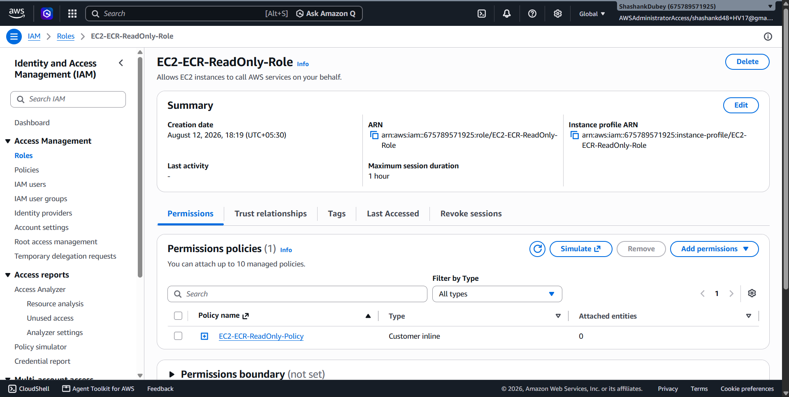
*Figure 1: IAM Role `EC2-ECR-ReadOnly-Role` created in AWS IAM Console.*

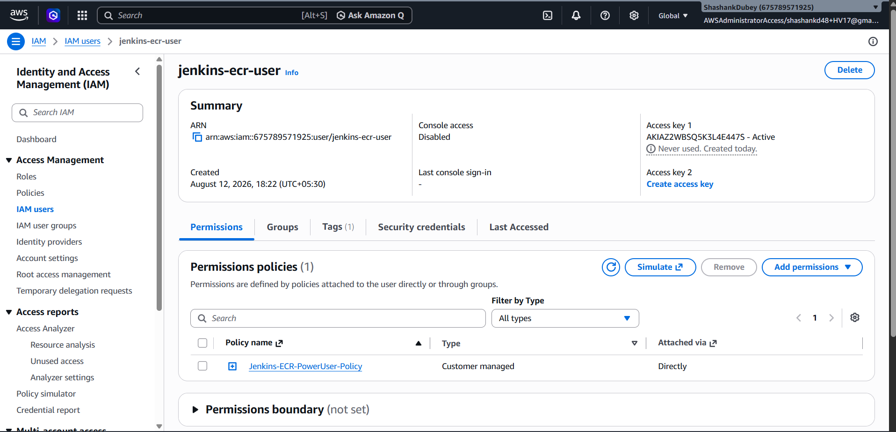
*Figure 2: IAM User `jenkins-ecr-user` created for Jenkins ECR authentication.*

---

### Step 2: AWS Security Group Setup (`flask-jenkins-sg`)

Created Security Group **`flask-jenkins-sg`** attached to the EC2 instance with the following inbound rules:
- **SSH (Port 22)**: For SSH deployment commands from Jenkins and terminal management.
- **HTTP/Jenkins (Port 8080)**: For accessing the Jenkins Web UI and receiving GitHub Webhooks.
- **Flask App (Port 5000)**: For public access to the deployed Flask Web Application and health verification.

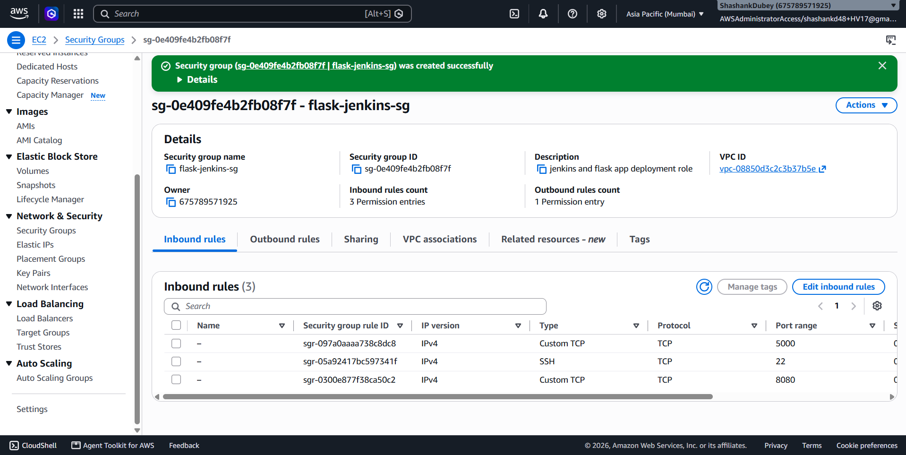
*Figure 3: Security Group `flask-jenkins-sg` configured with inbound rules for Ports 22, 8080, and 5000.*

---

### Step 3: EC2 Instance Provisioning

Provisioned an **Ubuntu 22.04 LTS (t2.micro)** EC2 instance attached with `flask-jenkins-sg` Security Group and `EC2-ECR-ReadOnly-Role` IAM Role.

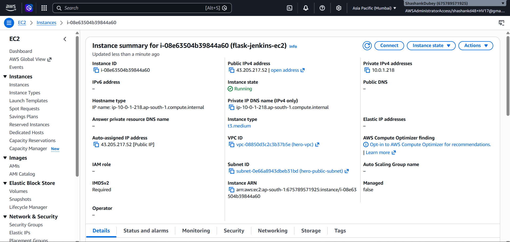
*Figure 4: EC2 Instance `Jenkins-Flask-Server` active in AWS Console.*

---

### Step 4: EC2 Server Initialization Script

Executed the automated setup shell script on the EC2 server to install OpenJDK 21, Docker engine, AWS CLI, Python venv, and Jenkins LTS.

#### **Complete Server Setup Script (`setup-server.sh`)**:
```bash
#!/bin/bash
set -e

echo "=== 1. Updating System & Installing Dependencies ==="
sudo apt-get update -y
sudo apt-get install -y ca-certificates curl gnupg lsb-release fontconfig openjdk-21-jre openjdk-21-jdk awscli python3-venv python3-pip

echo "=== 2. Installing & Enabling Docker ==="
sudo apt-get install -y docker.io
sudo systemctl enable --now docker
sudo usermod -aG docker ubuntu || true

echo "=== 3. Adding Jenkins Official GPG Key & Repository ==="
sudo mkdir -p /usr/share/keyrings
sudo curl -fsSL https://pkg.jenkins.io/debian-stable/jenkins.io-2023.key | sudo tee /usr/share/keyrings/jenkins-keyring.asc > /dev/null

echo "deb [signed-by=/usr/share/keyrings/jenkins-keyring.asc] https://pkg.jenkins.io/debian-stable binary/" | sudo tee /etc/apt/sources.list.d/jenkins.list > /dev/null

echo "=== 4. Installing Jenkins ==="
sudo apt-get update -y
sudo apt-get install -y jenkins

echo "=== 5. Configuring Jenkins Permissions & Starting Service ==="
sudo usermod -aG docker jenkins
sudo systemctl enable --now jenkins
sudo systemctl restart jenkins

echo "=== 6. Jenkins Setup Complete! ==="
echo "Your initial Jenkins Admin Password is:"
sudo cat /var/lib/jenkins/secrets/initialAdminPassword
```

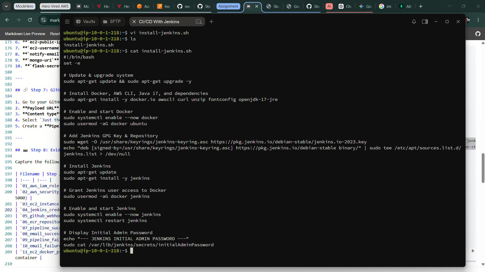
*Figure 5a: Automated shell script executing package installations on EC2.*

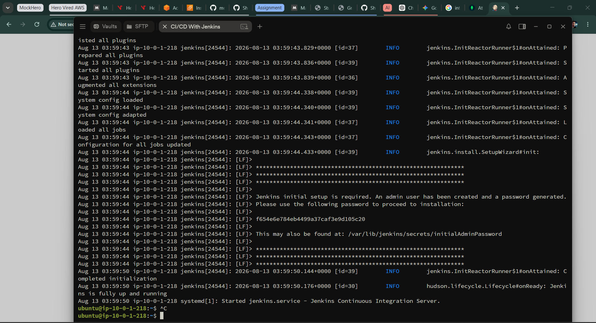
*Figure 5b: Unlocking Jenkins using the initial admin password from `/var/lib/jenkins/secrets/initialAdminPassword`.*

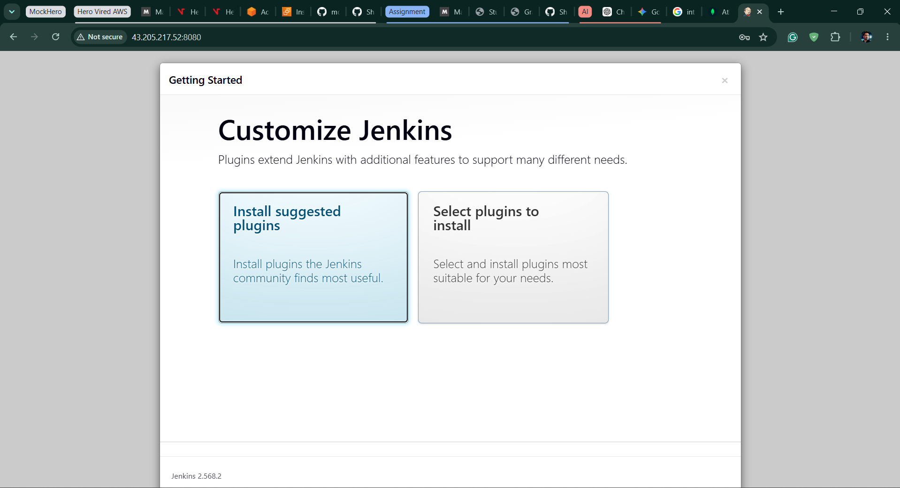
*Figure 5c: Installing suggested plugins (Git, Pipeline, SSH Agent, Email Extension).*

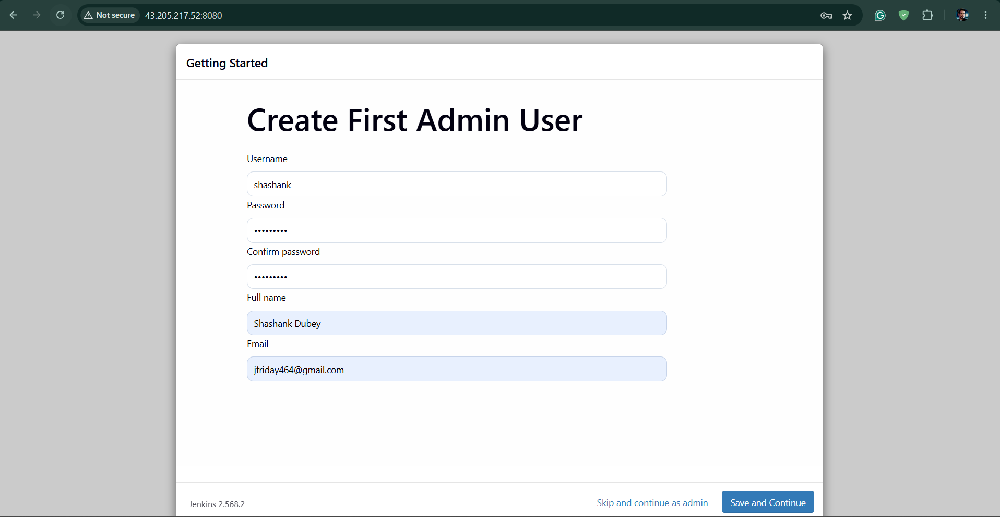
*Figure 5d: Creating the primary administrator user account in Jenkins.*

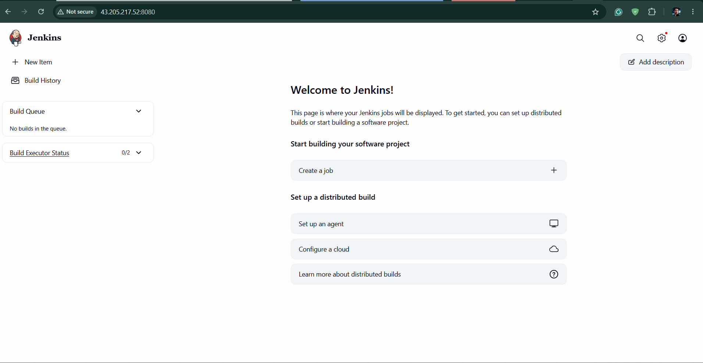
*Figure 5e: Jenkins server setup complete and ready for pipeline configuration.*

---

### Step 5: Amazon ECR Repository Creation

Created a private Amazon ECR repository **`flask-student-app`** in AWS Region `ap-south-1` to store versioned Docker images tagged with Git Commit SHAs (`${GIT_COMMIT}`).

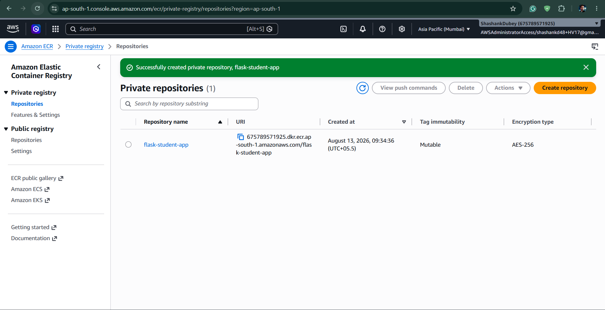
*Figure 6: Amazon ECR repository `flask-student-app` created in AWS Console.*

---

### Step 6: MongoDB Atlas Database Setup

1. Configured a MongoDB Atlas cloud cluster for scalable database storage.
2. Created database user credentials for application connection.
3. Whitelisted the EC2 instance IP in Atlas **Network Access** rules.

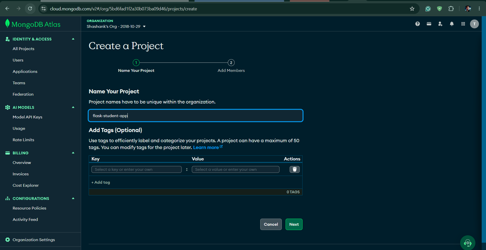
*Figure 7a: Configuring MongoDB Atlas cloud database for application storage.*

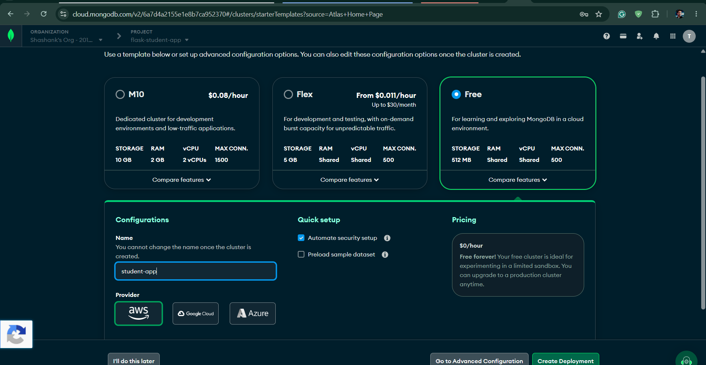
*Figure 7b: Creating MongoDB Atlas cluster and database user access.*

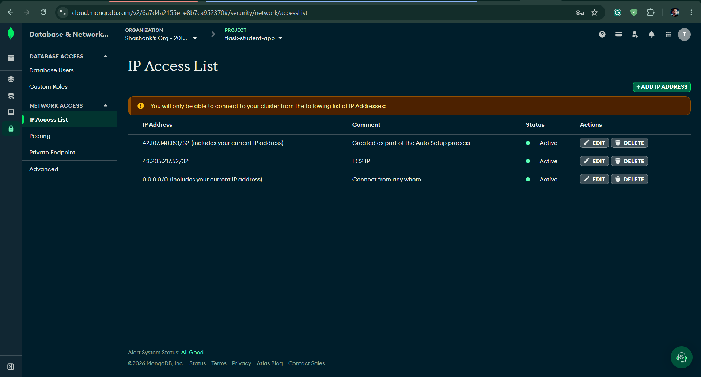
*Figure 7c: Restricting MongoDB Atlas Network Access rules to the server IP.*

---

### Step 7: Jenkins Setup & Credentials Configuration

Configured 11 sensitive environment variables and credentials in Jenkins Global Credentials Store:

| # | Credential ID | Kind | Configured Value / Description |
| :-: | :--- | :--- | :--- |
| 1 | `aws-credentials` | Username with password | AWS Access Key ID & Secret Access Key |
| 2 | `ec2-ssh-key` | SSH Username with private key | Username `ubuntu` with `.pem` Private Key |
| 3 | `aws-account-id` | Secret text | 12-digit AWS Account ID |
| 4 | `aws-region` | Secret text | `ap-south-1` |
| 5 | `ecr-repo-name` | Secret text | `flask-student-app` |
| 6 | `ec2-public-ip` | Secret text | EC2 Public IP address |
| 7 | `ec2-username` | Secret text | `ubuntu` |
| 8 | `notify-email` | Secret text | Recipient Email Address for notifications |
| 9 | `mongo-uri` | Secret text | Production MongoDB URI (`student_db`) |
| 10 | `test-mongo-uri` | Secret text | Test Suite MongoDB URI (`test_student_db`) |
| 11 | `flask-secret-key` | Secret text | Flask session secret key |

> **Note on SCM Credentials**: Because the GitHub repository is public, SCM Credentials in the Pipeline Job configuration remain set to **`- none -`**.

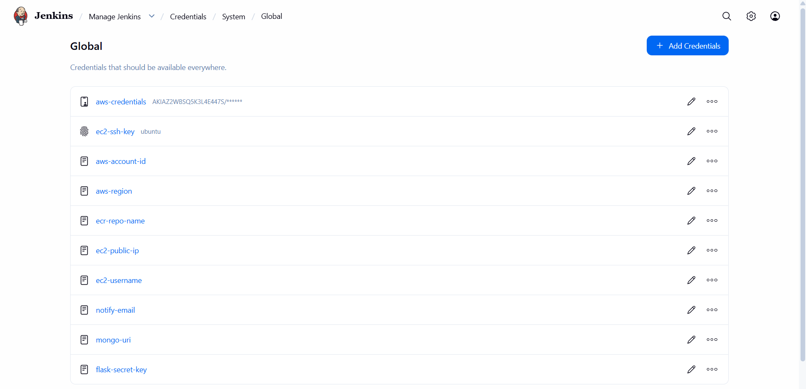
*Figure 8: Registered credentials in Jenkins Global Credentials Store.*

---

### Step 8: Configure GitHub Webhook & Jenkins Pipeline Job

1. Configured GitHub Webhook under Repository Settings → Webhooks with Payload URL `http://<EC2_IP>:8080/github-webhook/`.
2. Created Pipeline Job `flask-student-pipeline` in Jenkins configured with `GitHub hook trigger for GITScm polling` pointing to `Jenkinsfile` on branch `*/main`.

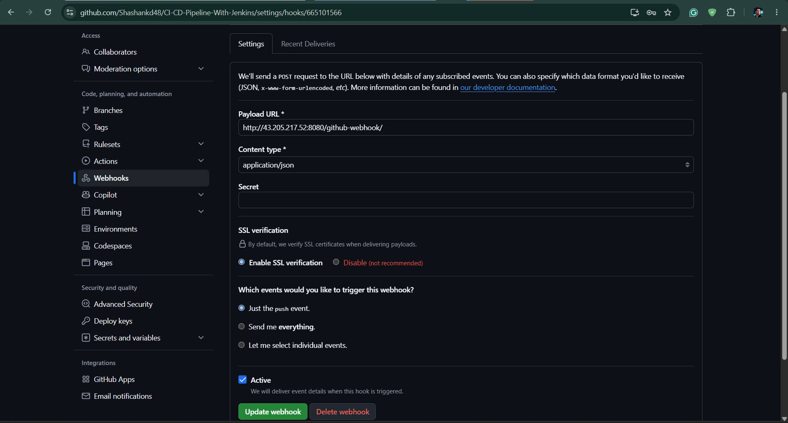
*Figure 9a: Configuring GitHub Webhook with Payload URL for automatic push triggers.*

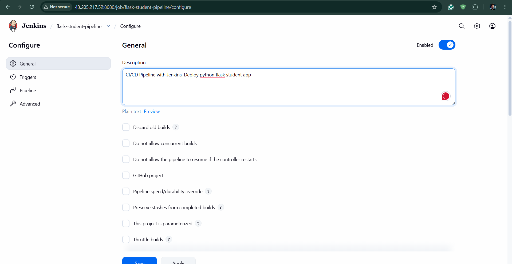
*Figure 9b: Configuring Pipeline Job in Jenkins referencing `Jenkinsfile` on `*/main`.*

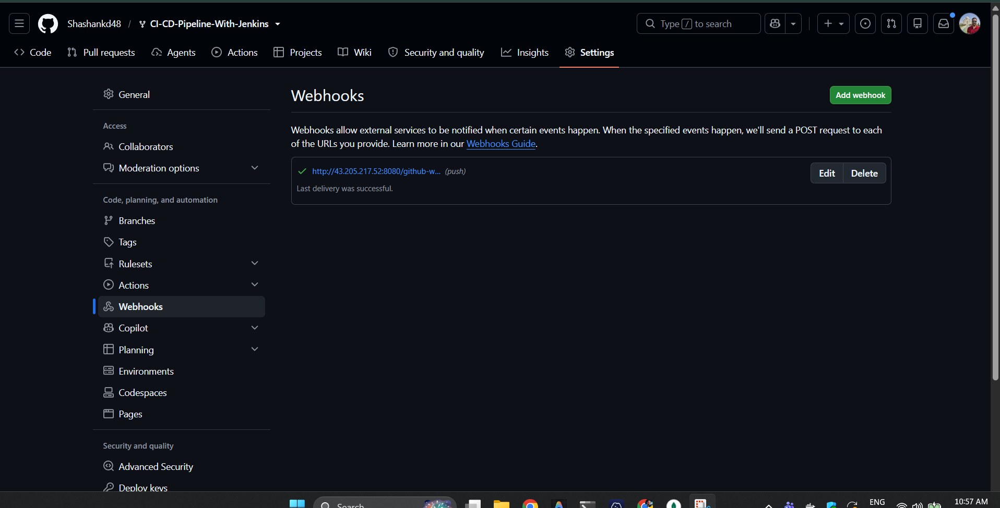
*Figure 9c: GitHub Webhook delivery verification returning HTTP 200 payload success.*

---

### Step 9: SMTP Email Notification Setup (Gmail SMTP)

Configured Jenkins Extended E-mail Notification to send HTML build status emails:

1. **Google App Password**: Generated a 16-character App Password under Google Account Security.
2. **Jenkins Location**: Set **System Admin e-mail address** in Manage Jenkins → System.
3. **Extended E-mail Notification**:
   - **SMTP server**: `smtp.gmail.com`
   - **SMTP Port**: `465`
   - **Credentials**: Added Username with password (`user@gmail.com` + 16-char App Password).
   - **Use SSL**: Checked.
4. **E-mail Notification**: Tested configuration sending test email to verify.

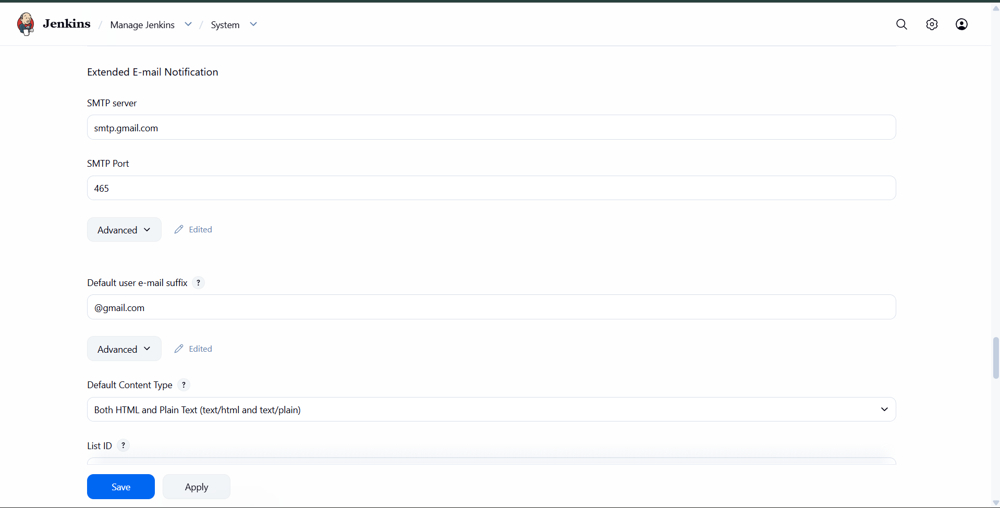
*Figure 10: Configuring Gmail SMTP authentication and SSL credentials in Jenkins Extended E-mail Notification.*

---

### Step 10: CI/CD Pipeline Execution, Quality Gating & Live Deployment Verification

The CI/CD pipeline executes across 8 stages defined in [Jenkinsfile](file:///d:/Study/HeroVired/assignments/CI%20CD%20Pipeline%20Assignment/Jenkinsfile):

1. **Checkout**: Pulls code from GitHub `main` branch and sets `IMAGE_TAG` from `${GIT_COMMIT}`.
2. **Install Dependencies**: Provisions Python virtual environment and installs `requirements.txt`.
3. **Test Gate**: Runs `pytest test_app.py`. Aborts pipeline immediately if unit tests fail.
4. **Build Multi-Stage Docker Image**: Builds optimized multi-stage Docker container tagged with Git SHA.
5. **Push to Amazon ECR**: Authenticates to ECR via AWS CLI and pushes container image.
6. **Deploy to EC2**: Connects to EC2 via SSH, pulls new image, stops existing container, and runs updated container.
7. **Deploy Verification Gate**: Sends HTTP request to `http://${EC2_HOST}:5000/health` to verify HTTP 200 status.
8. **Post Notification**: Dispatches HTML status email notification to recipient.

#### **Quality Gate Enforcement (Test Failure Stop)**
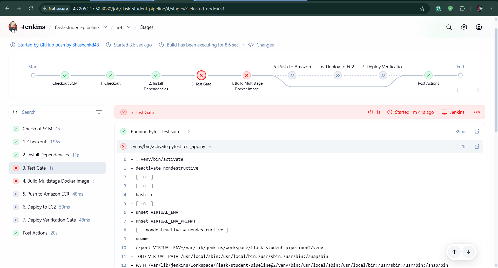
*Figure 11a: Quality Gate demonstration - pipeline execution halted at Stage 3 due to unit test failure, blocking bad deployment.*

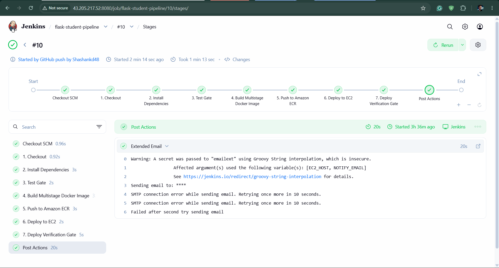
*Figure 11b: Successful build execution prior to final SMTP configuration.*

#### **Intentional Failure Alert Testing**
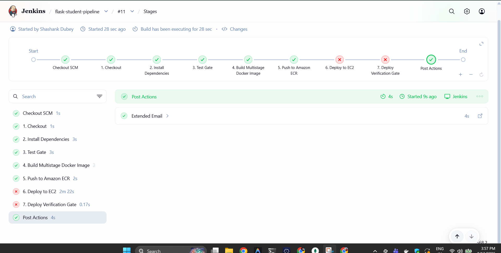
*Figure 12a: Intentional broken build triggering stage failure in Jenkins.*

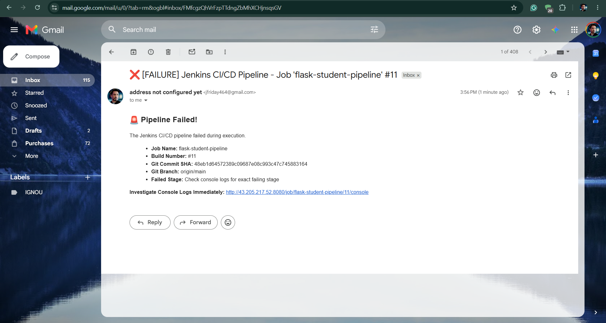
*Figure 12b: Automated HTML alert email received in Gmail inbox detailing build failure.*

#### **End-to-End Successful Deployment & Live Verification**
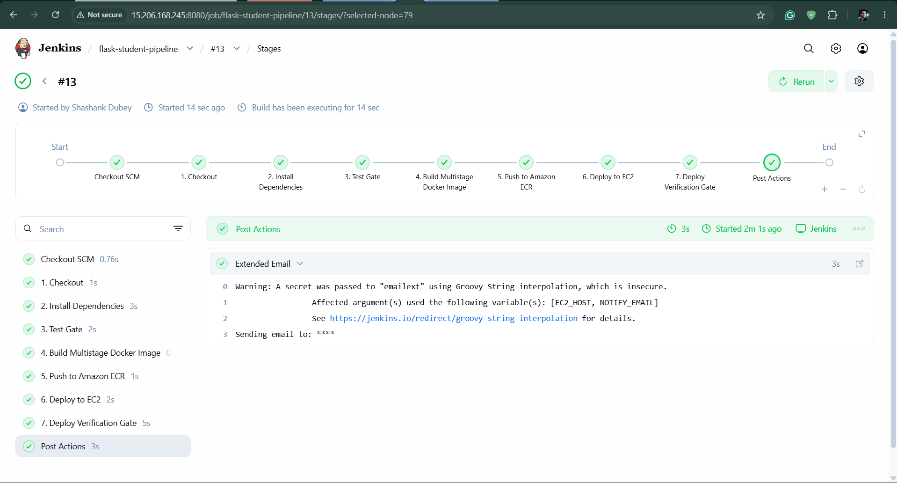
*Figure 13a: Complete 8-stage pipeline run passing in Jenkins Stage View.*

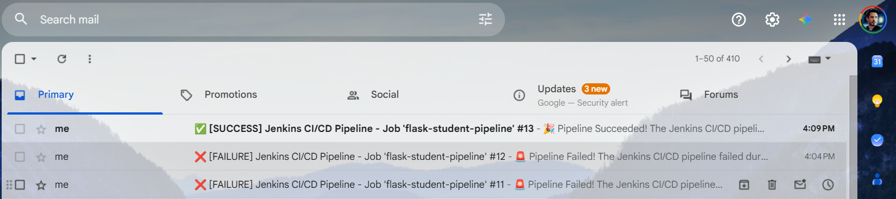
*Figure 13b: Automated HTML success notification received in Gmail inbox containing build details, Git SHA, and EC2 host.*

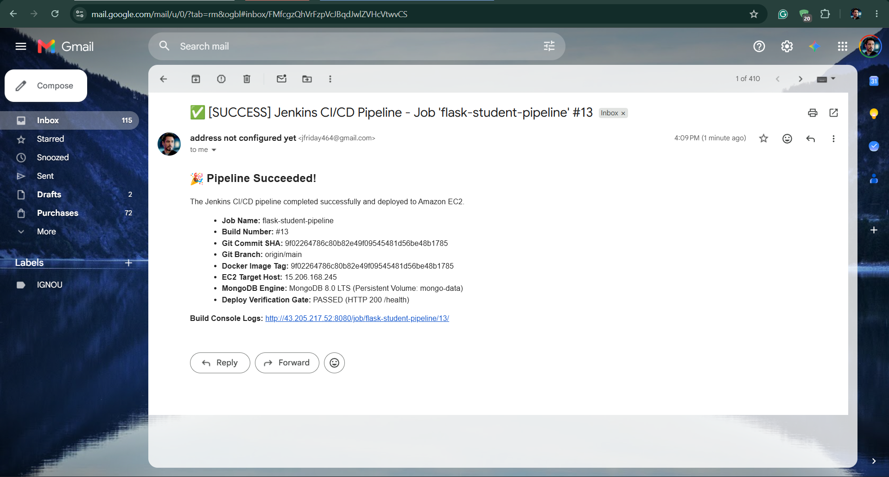
*Figure 13c: Live Flask application active on EC2 (`http://<EC2_IP>:5000/`) alongside success email confirmation.*

---

## 🧪 Local Test Verification

To run unit tests locally without modifying application data:

```bash
python -m pytest test_app.py
```

Expected Output:
```text
============================= test session starts =============================
platform win32 -- Python 3.14.3, pytest-9.1.1, pluggy-1.6.0
rootdir: D:\Study\HeroVired\assignments\CI CD Pipeline Assignment
collected 5 items

test_app.py .....                                                        [100%]

============================== 5 passed in 0.57s ==============================
```

---

## 📄 License & Maintainer
- **Project**: CI/CD Pipeline Assignment
- **Maintainer**: DevOps Engineering Student
